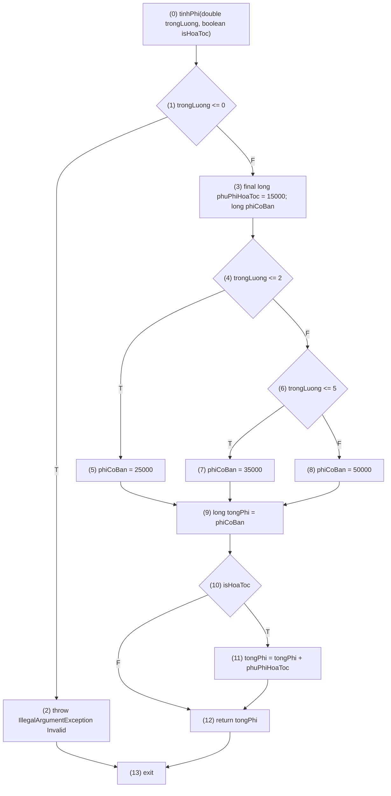

# 📦 Kiểm Thử Dòng Điều Khiển - Công Cụ Tính Phí Vận Chuyển

Dự án này là bài tập thực hành áp dụng phương pháp **Kiểm thử dòng điều khiển (Control Flow Testing)** với tiêu chuẩn độ phủ nhánh **C2 (Branch Coverage)** cho bài toán Tính Phí Vận Chuyển.

## 📝 Bài 5: Mô Tả Bài Toán

Hệ thống sẽ tính phí vận chuyển dựa trên trọng lượng của gói hàng (kg) và loại hình giao hàng (thường hoặc hỏa tốc).
Phí vận chuyển được xác định theo bảng sau:

| Trọng lượng (kg) | Phí cơ bản (VNĐ) |
| :--- | :--- |
| `0 < trọng lượng ≤ 2` | 25.000 |
| `2 < trọng lượng ≤ 5` | 35.000 |
| `trọng lượng > 5` | 50.000 |

**Quy tắc bổ sung:**
- Nếu khách hàng chọn **giao hỏa tốc**, hệ thống sẽ cộng thêm phụ phí `15.000` vào tổng phí vận chuyển. 
- Nếu `trọng lượng ≤ 0`, dữ liệu được xem là không hợp lệ và hệ thống sẽ báo lỗi.

### Tóm tắt Input / Output

**Đầu vào (Input):**

| Tên biến | Kiểu dữ liệu | Ý nghĩa |
| :--- | :--- | :--- |
| `trongLuong` | `double` | Trọng lượng của gói hàng (kg) |
| `isHoaToc` | `boolean` | `true` nếu chọn giao hỏa tốc, `false` nếu giao thường |

**Đầu ra (Output):**

Kiểu dữ liệu: `long`
- Trả về tổng phí vận chuyển của gói hàng. 
- Nếu trọng lượng ≤ 0, hệ thống sẽ ném ngoại lệ với thông báo: `"Invalid"`.

### Các Quy tắc tính phí (Logic rule)
1. Nếu `trongLuong <= 0` → báo lỗi: `"Invalid"`. 
2. Nếu `0 < trongLuong <= 2` → phí cơ bản = 25.000. 
3. Nếu `2 < trongLuong <= 5` → phí cơ bản = 35.000. 
4. Nếu `trongLuong > 5` → phí cơ bản = 50.000. 
5. Nếu `isHoaToc = true` → cộng thêm 15.000 vào phí cơ bản.

---

## 🏗 Đồ Thị Dòng Điều Khiển (CFG)

Đồ thị Control Flow Graph cho hàm `tinhPhi` ứng với phân tích độ đo C2:




---

## 🧪 Kiểm Thử Độ Phủ C2 (Branch Coverage)

Để đảm bảo được **100% độ phủ nhánh (C2)**, ta cần xác định các điểm quyết định (if) trên đồ thị. Với mỗi điểm quyết định, cả hai nhánh `True` và `False` đều phải được đi qua ít nhất 1 lần. 

**Kết quả mức độ phủ:** `Bcov = 8/8 = 1`

### Xây dựng các ca kiểm thử (Test Cases)

| STT | Khảo sát Path | Biến thử (Test Input) | Đầu ra mong đợi (Expected Output) |
| :---: | :--- | :--- | :--- |
| 1 | `1(T) 2` | `trongLuong = 0`, `isHoaToc = false` | `IllegalArgumentException("Invalid")` |
| 2 | `1(F) 3 4(T) 5 9 10(T) 11 12` | `trongLuong = 2`, `isHoaToc = true` | `40000` |
| 3 | `1(F) 3 4(F) 6(T) 7 9 10(F) 12` | `trongLuong = 5`, `isHoaToc = false`| `35000` |
| 4 | `1(F) 3 4(F) 6(F) 8 9 10(T) 11 12`| `trongLuong = 6`, `isHoaToc = true` | `65000` |

### Kết quả chạy kiểm thử (Test Results)

Kết quả trả về tự động test Runner trên Source Code của Java/JUnit:

| STT | Biến thử (Test Input) | Expected Output | Actual Output | Result |
| :---: | :--- | :--- | :--- | :---: |
| 1 | `trongLuong = 0, isHoaToc = false` | `IllegalArgumentException("Invalid")` | `IllegalArgumentException("Invalid")` | ✅ **Pass** |
| 2 | `trongLuong = 2, isHoaToc = true` | `40000` | `40000` | ✅ **Pass** |
| 3 | `trongLuong = 5, isHoaToc = false` | `35000` | `35000` | ✅ **Pass** |
| 4 | `trongLuong = 6, isHoaToc = true` | `65000` | `65000` | ✅ **Pass** |

---

## 🚀 Hướng Dẫn Chạy Cục Bộ (Run Local Environment)
Dự án được xây dựng trên ngôn ngữ **Java** và sử dụng **Maven**. Trình kiểm thử: **JUnit 5**.

Để chạy kiểm thử tự động trực tiếp trên Terminal/Console:
```bash
# Set chuẩn file encoding về UTF-8 (Giúp in console log Tiếng Việt không bị lỗi font trên Windows)
chcp 65001

# Chạy test thông qua Maven
mvn clean test
```
